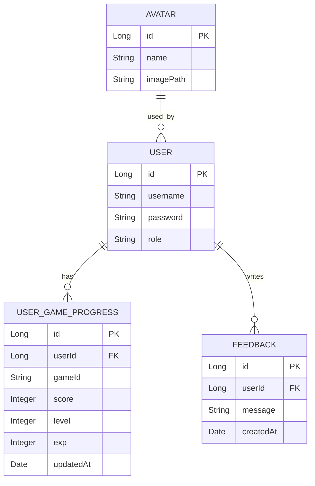

# Database & ER — App Arcade

Descrizione entità e relazioni principali. Il diagramma deve essere coerente con le entity e annotazioni JPA.

## Entità

- User
  - id (PK)
  - username (unique)
  - password (hashed)
  - email? (se presente nel codice)
  - role (es. USER/ADMIN)
  - avatar (relazione con Avatar)
- Avatar
  - id (PK)
  - name
  - url/path immagine
- UserGameProgress
  - id (PK)
  - user (FK → User)
  - gameId / gameName
  - score
  - level / exp
  - updatedAt
- Feedback
  - id (PK)
  - user (FK → User)
  - message
  - createdAt

## Relazioni (attese)

- User 1 — N UserGameProgress
- User 1 — N Feedback
- User N — 1 Avatar (o 1 — 1 a seconda del codice, qui assunto N:1 molti utenti possono condividere un avatar predefinito)

## ER Diagram (Mermaid)

Note: verificare campi esatti confrontandoli con le classi in `models/`. Aggiornare se divergono.
