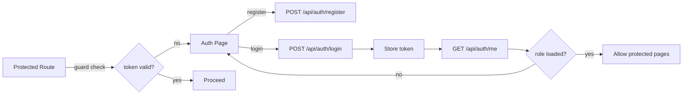

# Flusso Autenticazione — App Arcade

Descrive registrazione, login, caricamento ruolo, redirect e protezione pagine.

## Sequenza
1. Registrazione: POST `/api/auth/register` con credenziali → creazione utente.
2. Login: POST `/api/auth/login` → risposta con token/sessione.
3. Me: GET `/api/auth/me` → restituisce profilo/ruolo.
4. Frontend salva sessione/token (es. localStorage) e aggiorna stato UI.
5. Route guard: su pagine protette (Profile/Play submit) verifica presenza/validità token.
6. Redirect: se non autenticato → `/auth`; se autenticato → pagina richiesta o `/profile`.

## Diagramma (Mermaid)

## Protezione pagine
- Implementata lato backend via Spring Security (filtri e antMatchers/HttpSecurity).
- Lato frontend con `guard.js` che intercetta navigazione e verifica sessione.
