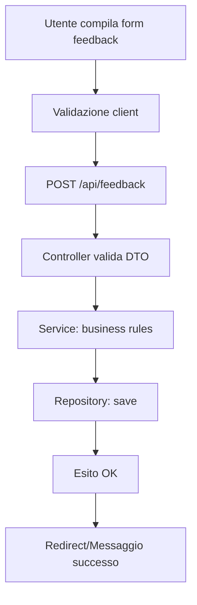
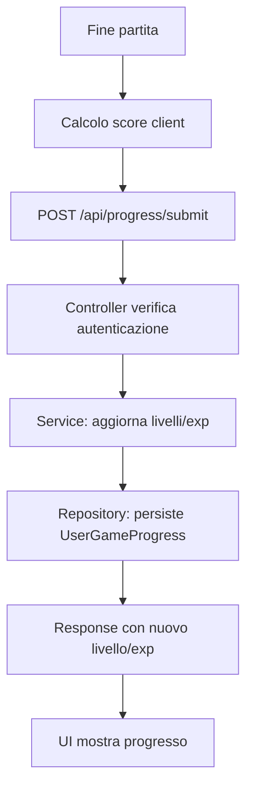
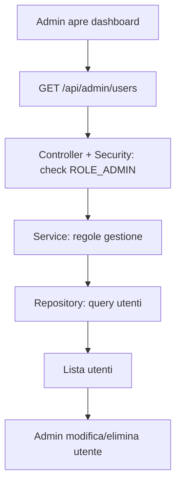

# Diagrammi dei Flussi Principali — App Arcade

Almeno un flow chart per: CRUD, azione utente, azione admin.

## CRUD (Esempio: Creazione Feedback)

## Azione Utente (Invio punteggio gioco)

## Azione Admin (Gestione utenti) — opzionale

Note: la parte Admin è prevista come estensione. Allineare con implementazione reale se introdotta.
