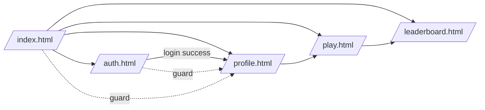

# UI Flows — App Arcade

Schema di navigazione frontend e differenze user/admin.

## Mappa Pagine

- Home → `index.html`
  - mostra anteprima leaderboard, link a giochi, feedback
- Auth → `auth.html`
  - login/registrazione
- Profile → `profile.html`
  - modifica username/password, seleziona avatar
- Play → `play.html`
  - accesso ai giochi (flappy, invaders)
- Leaderboard → `leaderboard.html`
  - classifiche globali

## Navigazione e Ruoli

- Utente non autenticato
  - Accesso: Home, Auth, Leaderboard (in sola lettura), Play (se previsto, altrimenti redirect a Auth)
  - Route guard su pagine protette: Profile, submit score
- Utente autenticato (USER)
  - Accesso completo a: Profile, Play, submit progressi, Feedback
- Admin (se previsto nel codice)
  - Sezioni admin dedicate (non presenti nelle pagine elencate), possibili viste gestione utenti/feedback

## Template riutilizzabili

- Partials: `static/partials/header.html`, `static/partials/footer.html` caricati da `static/js/partials.js`
- JS comuni: `static/js/api.js`, `static/js/guard.js`, `static/js/app-meta.js`, `static/js/to-top.js`

## Diagramma Navigazione (Mermaid)

